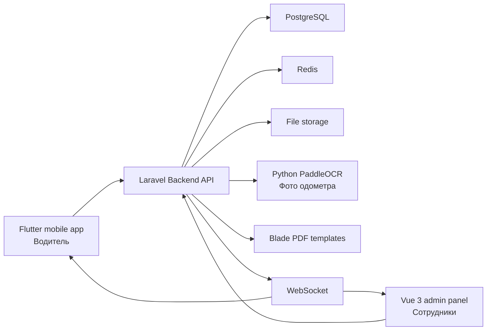

# Информационная система ООО «АЗЫК»

Проект выпускной квалификационной работы: «Проектирование информационной системы ООО “АЗЫК” и разработка программного обеспечения для задачи управления автотранспортом».

Система является внутренней информационной системой предприятия. Публичного интерфейса нет. В составе проекта предусмотрены:

- `backend-api` — единый монолитный Laravel API;
- `admin-panel` — web-административная панель на Vue 3 + Pinia;
- `mobile-driver-app` — мобильное приложение водителя на Flutter;
- PostgreSQL — основная база данных;
- Redis — кэш, очереди и WebSocket-события;
- `ocr-service` — вспомогательный Python/PaddleOCR-модуль для распознавания фото одометра;
- Docker — единое окружение разработки и демонстрации.

## Назначение

Система автоматизирует управление автотранспортом предприятия:

- планирование смен и план-нарядов;
- открытие и ведение путевых листов;
- прохождение предрейсовых и послерейсовых медосмотров;
- прохождение предрейсовых и послерейсовых техосмотров;
- контроль смены водителя;
- учет заправок;
- имитацию GPS/ГЛОНАСС-мониторинга;
- распознавание показаний одометра по фото при начале и завершении смены;
- формирование PDF путевых листов;
- отчеты и экспорт в Excel;
- администрирование пользователей и справочников.

## Архитектура

Проект строится как распределенная клиент-серверная система:



Микросервисы не используются. Backend является единым монолитным Laravel API, внутри которого выделены модули по предметным областям.

## Репозитории

```text
backend-api/
  Laravel API, бизнес-логика, БД, PDF, отчеты, WebSocket

admin-panel/
  Vue 3 + Pinia административная панель сотрудников

mobile-driver-app/
  Flutter-приложение водителя с пошаговым workflow смены

docs/
  проектная документация для разработки и ВКР
```

## Документация

- [Архитектура](docs/architecture.md)
- [Бизнес-процессы и workflow](docs/workflow.md)
- [Структура базы данных](docs/database.md)
- [REST API и WebSocket](docs/api.md)
- [PDF и отчеты](docs/pdf-and-reports.md)
- [AI/OCR-контроль одометра](docs/ai-odometer-ocr.md)
- [Диаграммы для ВКР](docs/diploma-diagrams.md)

## Статус заготовки

Эта версия содержит проектную и кодовую основу:

- структуру трех репозиториев;
- Docker compose для демонстрационного окружения;
- миграции PostgreSQL;
- enum-статусы и сервис состояния путевого листа;
- маршруты Laravel API;
- PDF Blade-шаблоны;
- каркас Vue-админки;
- каркас Flutter-приложения.

## Запуск через Docker Compose

Серверная часть, база данных, Redis, nginx, worker, WebSocket и web-админка запускаются через Docker Compose:

```bash
docker compose up -d --build
```

После запуска:

- backend API: `http://localhost:8000/api`;
- web-админка: `http://localhost:5173`;
- OCR-сервис: `http://localhost:8001/health`;
- PostgreSQL: `localhost:5432`;
- Redis: `localhost:6379`;
- WebSocket: `localhost:8081`.

Первый запуск выполняет контейнер `backend-setup`: он готовит Laravel внутри Docker, накатывает миграции и заполняет тестовые данные. OCR-контейнер при первом распознавании скачает модели PaddleOCR в Docker volume. Локально PHP, Composer, PostgreSQL, Redis, Python, nginx и PaddleOCR ставить не нужно.

## Доступы

Админка открывается по адресу `http://localhost:5173`.

| Роль | Логин | Пароль |
|---|---|---|
| Администратор | `admin` | `admin123` |
| Диспетчер | `dispatcher` | `dispatcher123` |
| Медик | `medic` | `medic123` |
| Механик | `mechanic` | `mechanic123` |

Тестовый водитель для мобильного приложения:

| Роль | Логин | Пароль |
|---|---|---|
| Водитель | `driver1` | `driver123` |

## Мобильное приложение

Основной вариант использования — Flutter-приложение на телефоне или эмуляторе.

Запуск на Android-эмуляторе:

```bash
cd mobile-driver-app
flutter pub get
flutter run --dart-define=API_BASE_URL=http://10.0.2.2:8000/api
```

Запуск на iOS Simulator или desktop:

```bash
cd mobile-driver-app
flutter pub get
flutter run --dart-define=API_BASE_URL=http://localhost:8000/api
```

Сборка APK локальным Flutter:

```bash
cd mobile-driver-app
flutter pub get
flutter build apk --debug --dart-define=API_BASE_URL=http://IP_КОМПЬЮТЕРА:8000/api
```

APK будет создан в `mobile-driver-app/build/app/outputs/flutter-apk/app-debug.apk`.
