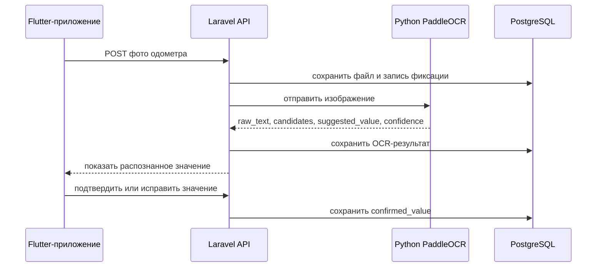

# AI/OCR-контроль одометра

## Что добавлено

В систему добавлена функция подтверждения компетенции ПК-5: применение нейросетевой OCR-модели для распознавания показаний одометра по фотографии приборной панели.

Функция встроена в существующий workflow путевого листа:

1. После открытия путевого листа водитель фиксирует начальный одометр.
2. После предварительного завершения рейса водитель фиксирует конечный одометр.
3. Backend сохраняет фото, OCR-результат и подтвержденное водителем значение отдельно.
4. После фиксации конечного значения рассчитывается пробег по одометру.
5. Если есть GPS-точки, backend рассчитывает GPS-пробег и показывает расхождение диспетчеру.

OCR не является доказательством нарушения и не записывает пробег автоматически. Это инструмент первичного распознавания: окончательное значение сохраняется только после подтверждения водителя.

## Архитектура



Laravel остается главным backend-приложением. Python-контейнер `ocr-service` только выполняет инференс PaddleOCR и возвращает JSON.

## База данных

Новая таблица: `waybill_odometer_captures`.

Основные поля:

| Поле | Назначение |
|---|---|
| `waybill_id` | связь с путевым листом |
| `capture_type` | `start` или `finish` |
| `file_id` | фото одометра в таблице `files` |
| `ocr_raw_text` | весь распознанный текст |
| `ocr_candidates` | найденные числовые кандидаты |
| `ocr_value` | предложенное OCR-значение |
| `ocr_confidence` | уверенность модели |
| `confirmed_value` | значение, подтвержденное водителем |
| `confirmed_by_user_id` | водитель, подтвердивший значение |
| `confirmed_at` | дата и время подтверждения |
| `recognition_status` | `pending`, `recognized`, `failed`, `confirmed`, `corrected` |
| `recognition_error` | ошибка распознавания, если она была |

Ограничения:

- для одного путевого листа допускается одна фиксация `start` и одна фиксация `finish`;
- конечное подтвержденное значение не может быть меньше начального;
- закрытие смены невозможно без подтвержденного начального и конечного одометра.

## API

### Мобильное приложение

| Метод | Endpoint | Назначение |
|---|---|---|
| POST | `/api/mobile/waybills/{waybill}/odometer-captures` | загрузить фото и запустить OCR |
| POST | `/api/mobile/waybills/{waybill}/odometer-captures/{capture}/confirm` | подтвердить или исправить значение |
| GET | `/api/mobile/waybills/{waybill}/odometer-control` | получить состояние фиксации и расчеты |

Загрузка фото принимает multipart-поля:

- `capture_type`: `start` или `finish`;
- `image`: jpg, jpeg, png или webp до 8 МБ.

Подтверждение принимает:

- `confirmed_value`: целое значение одометра в километрах.

### Админка

| Метод | Endpoint | Назначение |
|---|---|---|
| GET | `/api/admin/waybills/{waybill}/odometer-control` | просмотр фото, OCR-значений, подтверждений и контроля пробега |

Карточка путевого листа в админке показывает:

- фото начального и конечного одометра;
- OCR-значения и уверенность;
- подтвержденные значения;
- признак ручного исправления;
- пробег по одометру;
- GPS-пробег при наличии GPS-точек;
- расхождение и статус контроля.

## Статусы контроля

| Статус | Когда выставляется |
|---|---|
| `normal` | GPS-пробег есть, расхождение не выше порога, OCR не исправлялся |
| `requires_review` | превышен порог расхождения или водитель исправил OCR-значение |
| `not_available` | не хватает данных для сравнения |

Порог задается в `.env`:

```env
ODOMETER_GPS_REVIEW_THRESHOLD_KM=5
```

## Docker

OCR запускается отдельным контейнером:

```text
ocr-service/
  Dockerfile
  requirements.txt
  app/main.py
```

Запуск всей системы:

```bash
docker compose up -d --build
```

Проверка OCR-контейнера:

```bash
curl http://localhost:8001/health
```

При первом распознавании PaddleOCR скачивает модели в volume `ocr_models`, поэтому первый запрос может выполняться дольше обычного.

## Демонстрационный сценарий

1. Войти в мобильное приложение под водителем `driver1` / `driver123`.
2. Открыть путевой лист по активному план-наряду.
3. На экране начального одометра нажать «Сфотографировать одометр» или «Выбрать фото».
4. Дождаться текста «Распознаём показания одометра…».
5. Проверить распознанное значение, например `124580`, и нажать «Подтвердить».
6. Пройти предрейсовый медосмотр, техосмотр, печать и начать смену.
7. Завершить рейс.
8. Зафиксировать конечный одометр, например `124742`, и подтвердить.
9. Убедиться, что система показала пробег `162 км`.
10. Открыть в админке карточку путевого листа и показать блок «Контроль одометра».

Сценарий ошибки OCR:

1. Загрузить фото, где распознано неверное число.
2. Исправить значение в поле подтверждения.
3. Нажать «Подтвердить».
4. В админке в карточке путевого листа будет видно, что значение исправлено вручную, а статус контроля может стать `requires_review`.

## Что показать на защите

- экран мобильного приложения с фиксацией начального одометра;
- экран с распознанным значением и кнопкой подтверждения;
- экран фиксации конечного одометра;
- карточку путевого листа в админке с двумя фотографиями;
- рассчитанный пробег по одометру;
- сравнение с GPS-пробегом, если по смене есть GPS-точки;
- код/структуру `ocr-service` как пример применения нейросетевой OCR-модели.

## Ручные проверки

Минимальный набор проверок:

- нельзя запросить предрейсовый медосмотр без подтвержденного начального одометра;
- нельзя запросить послерейсовый медосмотр без подтвержденного конечного одометра;
- нельзя подтвердить конечный одометр меньше начального;
- при неудачном OCR можно вручную указать значение после загрузки фото;
- после закрытия смены `waybills.odometer_start`, `waybills.odometer_end` и блок в админке совпадают с подтвержденными значениями.
