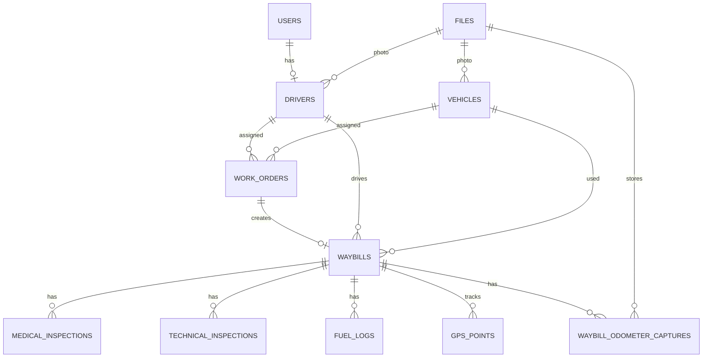

# Структура базы данных

Основная БД: PostgreSQL.

## Ключевые таблицы

| Таблица | Назначение |
|---|---|
| `users` | учетные записи всех пользователей |
| `drivers` | профиль водителя |
| `vehicles` | автомобили |
| `work_orders` | план-наряды |
| `waybills` | путевые листы |
| `medical_inspections` | медосмотры |
| `technical_inspections` | техосмотры |
| `fuel_logs` | заправки |
| `gps_points` | GPS-точки |
| `files` | фото и PDF-файлы |
| `waybill_odometer_captures` | фото одометра, OCR-результаты и подтвержденные значения |
| `audit_logs` | журнал действий |
| `personal_access_tokens` | токены Laravel Sanctum |

## Основные связи

## Ограничения

- `users.login` уникален.
- Водитель должен иметь учетную запись с ролью `driver`.
- На одного водителя допускается один активный план-наряд на дату и смену.
- Путевой лист создается только на основе план-наряда.
- Медосмотр и техосмотр имеют тип `pre_trip` или `post_trip`.
- Заправка может быть добавлена только во время активной смены.
- GPS-точки принимаются только для активного путевого листа.
- Для одного путевого листа допускается только одна фиксация одометра типа `start` и одна типа `finish`.
- Конечный подтвержденный одометр не может быть меньше начального.
